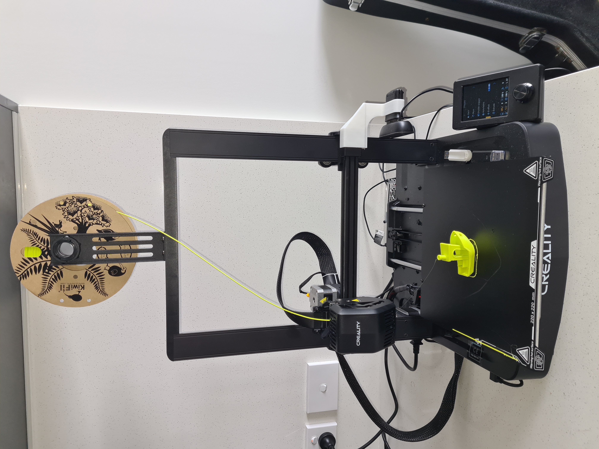
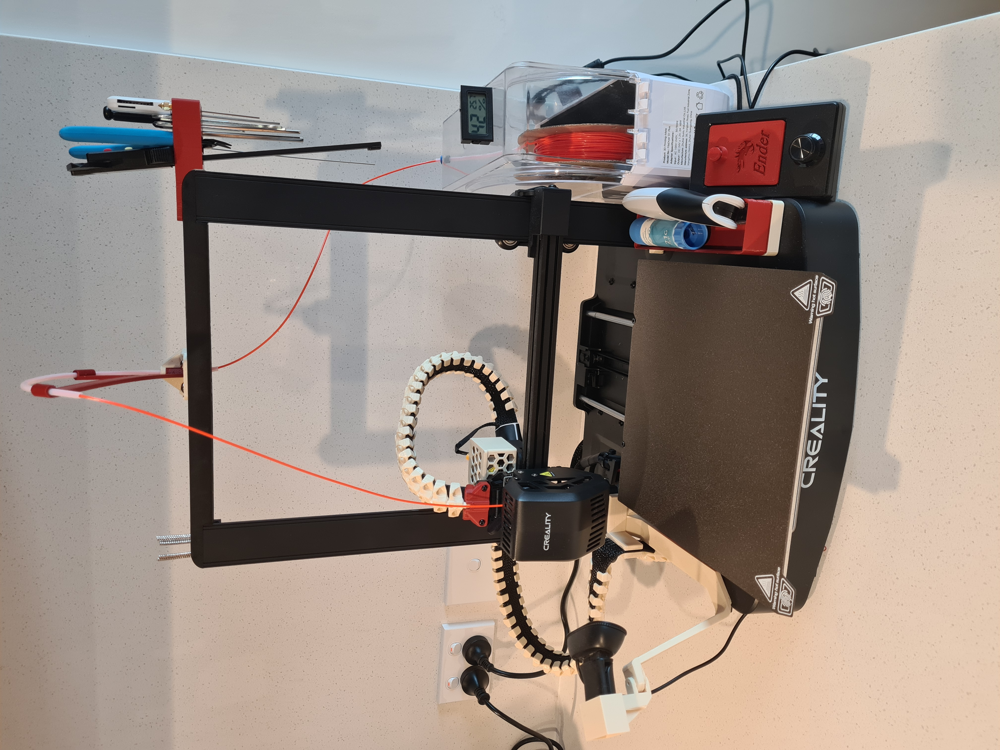
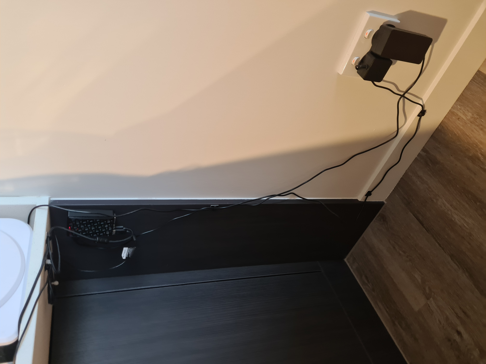
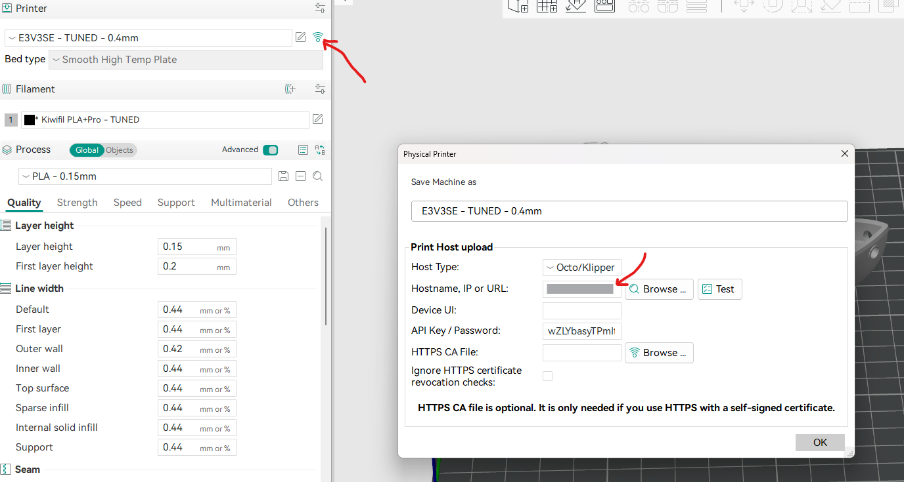

# Specs

Ender 3 v3 SE, before:



After:



[Printables profile](https://www.printables.com/@slowis_3350734)

## Printing setup

I set up Orcaslicer, with octoprint running on a raspberry pi. The in-app integration works super well.
Additionally, I installed tailscale on the rpi and my phone, which is a super easy way to access the printer remotely.
Just make sure to choose a secure password.



### Software links

- [Octoprint and raspberry pi](https://www.raspberrypi.com/tutorials/set-up-raspberry-pi-octoprint/)
- [OrcaSlicer download](https://orca-slicer.com/)
- [OrcaSlicer profile](https://github.com/galadriann/e3v3se-orca-profile), I use the Updated folder's E3V3SE - TUNED, with Kiwifil PLA+Pro.

Connecting orca slicer to octoprint was a little annoying. It only accepts a direct IP address, so you can ssh to your pi with something like:

```bash
# Update username if needed
ssh octopi@octopi

# On ocotopi:
ip -c -h address | grep wlan
```

Then add it under the prepare panel here:


The end result is really worth it though:

<video controls src="20250627-2224-59.9989143.mp4" title="Orca + benchy setup"></video>

### Octoprint plugins

Your octoprint won't look like this out of the box. Here's a few plugins that I use:

- UI Customizer -> make octopi not look awful.
- Timelapse purger -> auto-delete timelapses.
- OctoEverywhere
- PrintTimeGenius
- Slicer Thumbnails

## Upgrades

These are mainly just quality of life. Though I live in a very humid area, so the filament dryer is more essential than it may be for others.

- Filament dryer: [Sunlu](https://www.sunlu.com/products/sunlu-s1-and-s1-plus-filament-dryer-keeping-filament-dry-during-3d-printing).
- Filament feed system setup: [thingiverse page](https://www.thingiverse.com/thing:6210632).
- Print bed: [PEI/PEO](https://www.aliexpress.com/item/1005006595326667.html?src=google&snps=y&snpsid=1&src=google&albch=shopping&acnt=742-864-1166&isdl=y&slnk=&plac=&mtctp=&albbt=Google_7_shopping&aff_platform=google&aff_short_key=UneMJZVf&&albagn=888888&&ds_e_adid=&ds_e_matchtype=&ds_e_device=c&ds_e_network=x&ds_e_product_group_id=&ds_e_product_id=en1005006595326667&ds_e_product_merchant_id=5337445091&ds_e_product_country=NZ&ds_e_product_language=en&ds_e_product_channel=online&ds_e_product_store_id=&ds_url_v=2&albcp=22492609087&albag=&isSmbAutoCall=false&needSmbHouyi=false&gad_campaignid=22482571098).

To do:

- Noctua fan install: [reddit guide](https://www.reddit.com/r/Ender3V3SE/comments/1949xsc/creality_ender3_v3_se_fan_upgrade_replace_20mm/).
