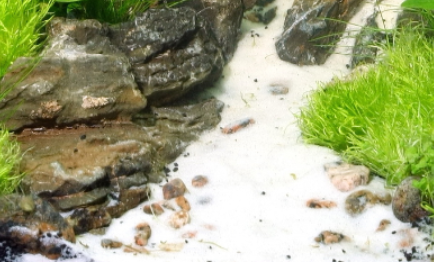
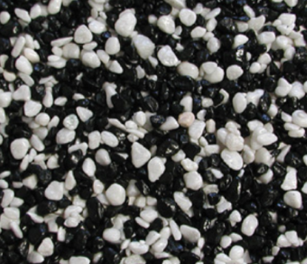
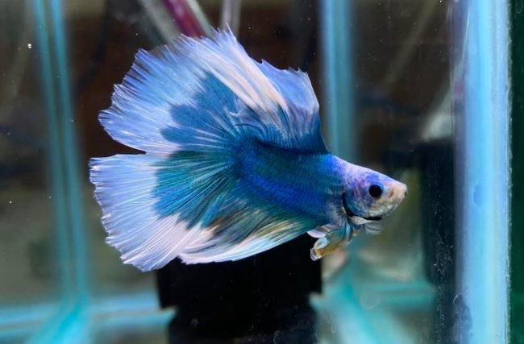
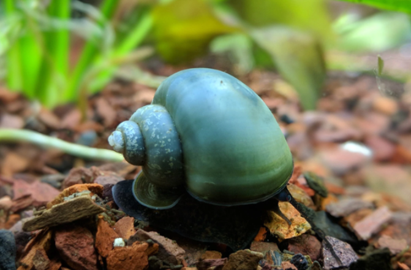
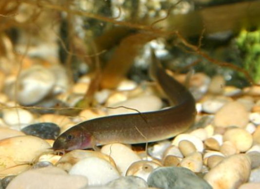

# Overview

A few years ago I had a betta fish briefly in a small aquarium. Let's build a natural tank that is nice and big, with plenty of room for a little guy/gal to thrive!

The plan is to buy the equipment and get the tank set up with natural plants first, let it acclimate for a month or so, then add our Betta alongside some companions. Initially, I thought shrimp would be nice to have, but these are banned in New Zealand! In stead, I'll get some snails and maybe a Kuhli loach.

## Equipment

### Tank

From reading around online, the general consensus seems to be that 5 gallons is the bare minimum and 10 gallons is at the larger end. So I've decided to go with 7 as the pragmatist's way out.

[This Aqua One tank](https://legacyaquatics.co.nz/product/aquaoneecostyle42black28l/) seems good. The main requirements that it adheres to is:

- My cat will hopefully not be able to infiltrate the tank.
- Dimensions are Size: 42W x 26D x 38H, Volume: 28L. The area I'm planning to place this on is at the kitchen counter, so this size seems good.
- Cost is quite low, comparable to second hand tanks on TradeMe.

### Heater

I read from some random source on the internet that 5W/gallon is a good metric. Therefore [this guy](https://legacyaquatics.co.nz/product/aquaone55wattglassheater/) should be plenty good.

Additionally, [this little thermometer](https://legacyaquatics.co.nz/product/glassredspiritthermometersmallround/) will be helpful for heater readings.

### Tank contents

Checking around online, [Anubias](https://legacyaquatics.co.nz/product/plant-anubias-nana/) sound like a good plant for bettas, so I'll get 2 of these. [Java fern](https://legacyaquatics.co.nz/product/plant-java-fern/) also looks great so I'll get one. Lastly, [Amazon Sword](https://legacyaquatics.co.nz/product/amazon-sword-live-plant/) is a really cool name, so I'll get one of these too.

Now for soil and decor. For decor, a nice centrepiece of [driftwood](https://legacyaquatics.co.nz/product/driftwood/) would work great! For substrate, [a bag of soil](https://legacyaquatics.co.nz/product/jbl-manado-5l-planting-substrate-2/) is needed for our plants to have a good basis. A [bright, white sand](https://legacyaquatics.co.nz/product/jbl-sansibar-white-5kg/) would look great for topping:



And lastly, this [white and black gravel](https://legacyaquatics.co.nz/product/aqua-one-mixed-white-black-gravel-2kg/) would look great in our kitchen:



### Fish and friends

I really love the look of [this male doubletail betta](https://legacyaquatics.co.nz/product/male-doubletail-betta/):



The above picture is the pastel Turquoise Butterfly colour. From the website, their preferences are:

```text
Betta ‘splendens’
pH range: 6.8-7.4
Temp range: 24-28°C
Approx. purchase size: 5-6cm
Max size: 6-8cm
Diet: Chiefly insectivorous but will take any animal-based proteins
```

This [blue mystery snail](https://legacyaquatics.co.nz/product/blue-mystery-snail/) is beautiful:



So getting two of these to start with should be good!

Lastly, I absolutely love [Kuhli Loaches](https://legacyaquatics.co.nz/product/black-kuhli-loach1/):



They have a cool name, work hard and are chill little guys. I'll get the tank acclimated first before I get one though.

## Cost

| Item | Price (NZD) | Running total (NZD) |
|------|-------------|---------------------|
| Aqua One EcoStyle 42 Black 28L | $139.99 | $139.99 |
| Aqua One 55W Glass Heater | $29.99 | $169.98 |
| Glass Red Thermometer | $4.99 | $174.97 |
| Anubias Nana Live Plant (x2) | $39.98 | $214.95 |
| Amazon Sword Live Plant | $13.99 | $228.94 |
| Java Fern Live Plant | $16.99 | $245.93 |
| JBL Manado Planting Substrate | $32.99 | $278.92 |
| JBL Sansibar White 5KG | $36.99 | $315.91 |
| Aqua One Mixed White + Black Gravel 2kg | $4.99 | $320.90 |
| Blue Mystery Snail (x2) | $21.00 | $341.90 |
| Driftwood (est. mid-range) | $40.00 | $381.90 |
| Male Doubletail Betta | $49.99 | $431.89 |
| Kuhli Loach | $10.99 | **$442.88** |

The above costing is quite high, but this will be a bit of a journey over time building a beautiful natural system.

## Timeline

I won't get all of the above items at once. Like I mentioned, I want to get the tank contents first. Then let it cycle for a bit, let the plants acclimate. Then I'll add the loach and the snails. Lastly, our betta boi!

<iframe src="betta-timeline.html" width="100%" height="600" frameborder="0" style="border-radius:12px;"></iframe>
