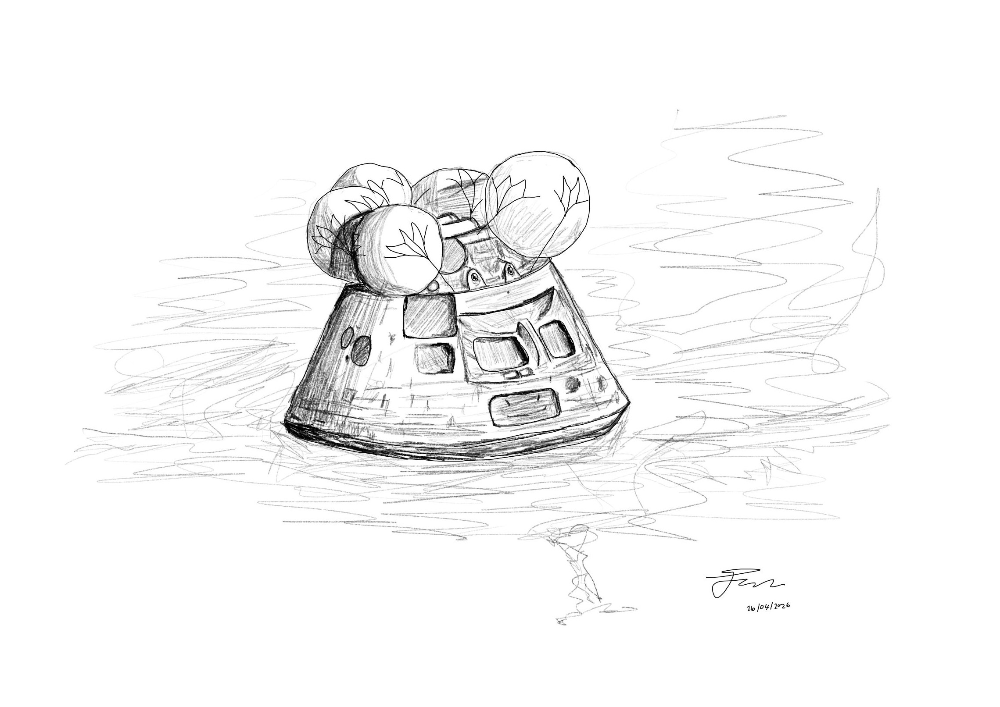

# Idle doodling

I got a Wacom Intuos drawing tablet a while back as a gift and it has been great for all sorts of random tasks, like filling in online documents, doing CAD drawings (but a mouse still seems best for that) and drawings. I installed Krita draw, which is free and open source. It has a ton of features and I am super happy with it.

## Lunar Lander

Got inspired from seeing the Artemis II re-entry and the scene where the lander is on its own in the ocean with its balloons deployed. The whole journey was incredible to watch and the lander in the waves looked so alone. Strange to think this is the least alone the astronauts have been for their entire trip!

