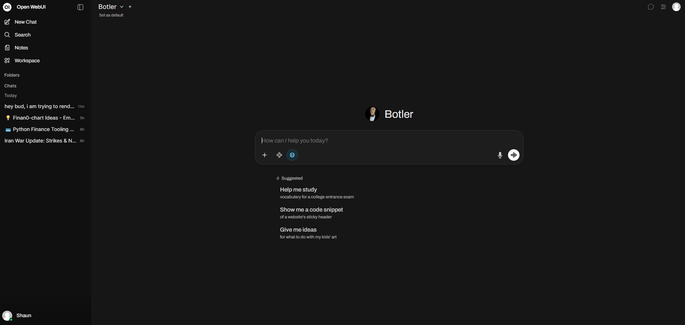

# Overview

With the recent disappointments around the use of AI for military strategy, I feel like we are living in turbulent times.
While we lack the ability for meaningful individual action, we as consumers have the capability of reducing ad revenue and
income of companies that we support.

To that extent, when using more heavy lifting tasks, I've switched to using Claude and wanted to run a small LLM locally too.

## Setup

See media_server section for specs, but I'll be running this on my Zbook.

### Model

First, install Nvidia drivers:

```bash
# Add the NVIDIA repo
curl -fsSL https://nvidia.github.io/libnvidia-container/gpgkey | sudo gpg --dearmor -o /usr/share/keyrings/nvidia-container-toolkit-keyring.gpg

curl -s -L https://nvidia.github.io/libnvidia-container/stable/deb/nvidia-container-toolkit.list | \
  sed 's#deb https://#deb [signed-by=/usr/share/keyrings/nvidia-container-toolkit-keyring.gpg] https://#g' | \
  sudo tee /etc/apt/sources.list.d/nvidia-container-toolkit.list

# Update and install
sudo apt update
sudo apt install nvidia-container-toolkit -y
```

Then Ollama:

```bash
curl -fsSL https://ollama.com/install.sh | sh
```

And a small model for local use:

```bash
ollama pull phi3:mini
```

### WebUI

I prefer running things in docker compose:

```yaml
services:
  open-webui:
    image: ghcr.io/open-webui/open-webui:main
    container_name: open-webui
    volumes:
      - open-webui:/app/backend/data
    network_mode: host
    environment:
      - OLLAMA_BASE_URL=http://127.0.0.1:11434
    restart: unless-stopped

volumes:
  open-webui:

```

## Usage

This turned out pretty great! Run your docker compose then check port 8080 on whatever host this is on.

## Preview

PLEASE NOTE THAT HIS NAME IS A PORTMANTEU OF BOT AND BUTLER. Not any other combination of words.

Here's what it looks like (I wanted to feel like batman):


