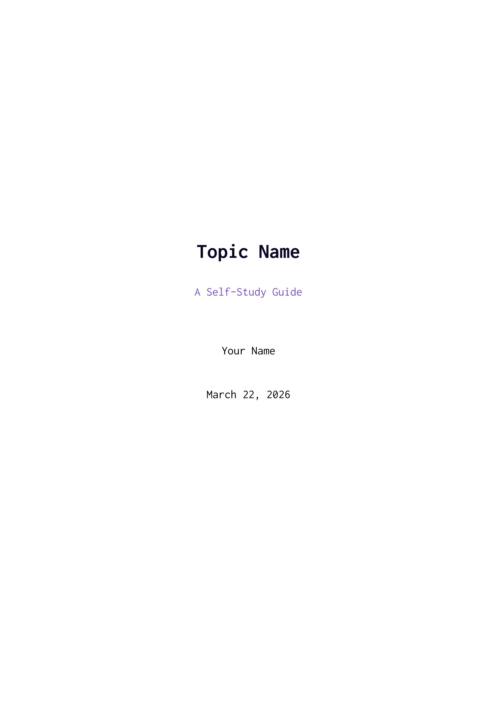
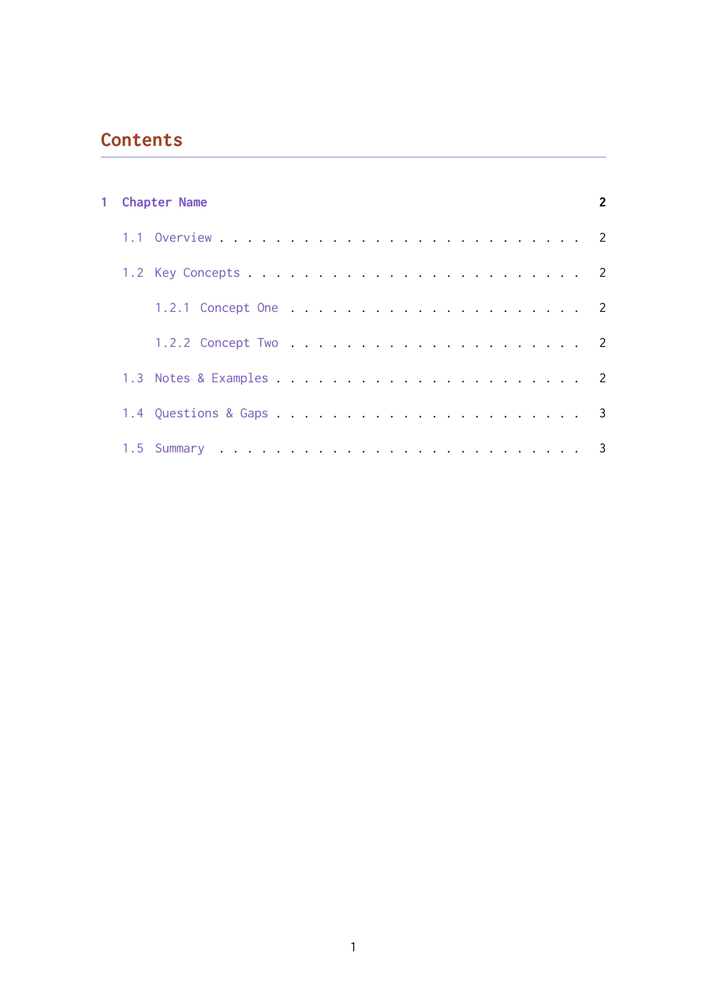
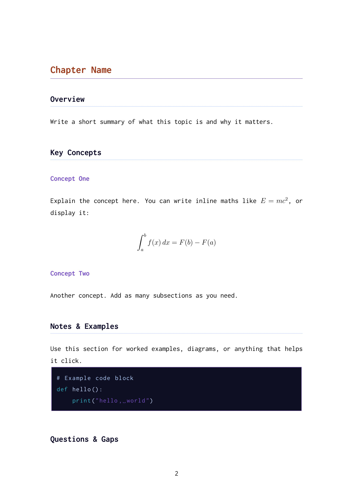
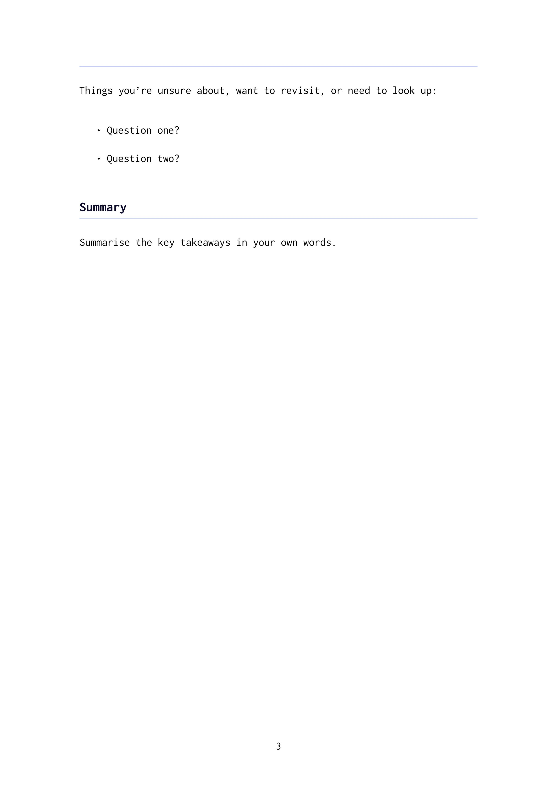

# Overview

Overleaf is a nice way of rendering and editing $\LaTeX$.

Running this locally has the benefit of being in control of templates, backups and privacy.

## Setup

I prefer hosting stuff with docker compose:

```yaml
services:

  sharelatex:
    image: sharelatex/sharelatex:latest
    container_name: sharelatex
    restart: unless-stopped
    depends_on:
      mongo:
        condition: service_healthy
      redis:
        condition: service_healthy
    ports:
      - "8181:80"
    volumes:
      - sharelatex_data:/var/lib/overleaf
    environment:
      OVERLEAF_APP_NAME: "Overleaf"
      OVERLEAF_MONGO_URL: mongodb://mongo/sharelatex?directConnection=true
      OVERLEAF_REDIS_HOST: redis
      REDIS_HOST: redis
      ENABLED_LINKED_FILE_TYPES: "project_file,project_output_file"
      ENABLE_CONVERSIONS: "true"
      EMAIL_CONFIRMATION_DISABLED: "true"
      # Uncomment and configure if you want email support:
      # OVERLEAF_EMAIL_FROM_ADDRESS: "noreply@example.com"
      # OVERLEAF_EMAIL_SMTP_HOST: "smtp.example.com"
      # OVERLEAF_EMAIL_SMTP_PORT: 587
      # OVERLEAF_EMAIL_SMTP_SECURE: "false"

  mongo:
    image: mongo:8.0
    container_name: sharelatex-mongo
    restart: unless-stopped
    command: "--replSet overleaf"
    volumes:
      - mongo_data:/data/db
    healthcheck:
      test: >
        mongosh --quiet --eval
        "try { rs.status().ok } catch(e) { rs.initiate({ _id: 'overleaf', members: [{ _id: 0, host: 'mongo:27017' }] }).ok }"
      interval: 10s
      timeout: 10s
      retries: 10
      start_period: 30s

  redis:
    image: redis:6.2
    container_name: sharelatex-redis
    restart: unless-stopped
    volumes:
      - redis_data:/data
    healthcheck:
      test: ["CMD", "redis-cli", "ping"]
      interval: 5s
      timeout: 5s
      retries: 5

volumes:
  sharelatex_data:
  mongo_data:
  redis_data:
```

**Optional extra**: add all fonts, extras to latex install:

```bash
docker exec sharelatex wget https://mirror.ctan.org/systems/texlive/tlnet/update-tlmgr-latest.sh
docker exec sharelatex sh update-tlmgr-latest.sh -- --update

# this takes forever - for me it took 45min
docker exec sharelatex tlmgr install scheme-full
```

Then you should be good to go with access on port `8181` on whatever you are hosting this on.

Lastly, don't forget to enable dark mode!


## Exporting from existing Overleaf projects

This is super simple, in your project list, click the download button in the online version.
Then click the new project button on your local version and select from zip file.

I haven't run into any issues with this, seems to work really well:


## A template that I like

Full $\LaTeX$ template for self-study here:
<details>

```latex
\documentclass[12pt, a4paper]{report}

% --- Fonts & Encoding ---
\usepackage[T1]{fontenc}
\usepackage[utf8]{inputenc}
\usepackage{inconsolata}          % clean monospaced font
\renewcommand{\familydefault}{\ttdefault}

% --- Colour ---
\usepackage[dvipsnames]{xcolor}
\definecolor{deepspace}{RGB}{10, 10, 40}
\definecolor{mars}{RGB}{160, 60, 30}           % mars red-brown for chapters
\definecolor{nebula}{RGB}{120, 80, 200}        % purple accent
\definecolor{stardust}{RGB}{180, 210, 255}     % pale blue for rules
\definecolor{cosmic}{RGB}{50, 180, 200}        % cyan for links
\definecolor{codebackground}{RGB}{15, 15, 35}  % dark bg for code
\definecolor{codetext}{RGB}{200, 220, 255}     % light text for code

% --- Page Layout ---
\usepackage[
  top=2.5cm,
  bottom=2.5cm,
  left=3cm,
  right=3cm
]{geometry}

% --- Spacing ---
\usepackage{setspace}
\setstretch{1.4}
\setlength{\parindent}{0pt}
\setlength{\parskip}{0.8em}

% --- Headings ---
\usepackage{titlesec}
\titleformat{\chapter}[hang]
  {\Large\bfseries\color{mars}}{}{0em}{}
  [{\color{nebula}\titlerule}]
\titlespacing*{\chapter}{0pt}{0pt}{1em}

\titleformat{\section}
  {\large\bfseries\color{deepspace}}{}{0em}{}
  [{\color{stardust}\titlerule}]

\titleformat{\subsection}
  {\normalsize\bfseries\color{nebula}}{}{0em}{}

\titleformat{\subsubsection}
  {\normalsize\itshape\color{deepspace}}{}{0em}{}

% --- Maths ---
\usepackage{amsmath, amssymb}

% --- Code Blocks ---
\usepackage{listings}
\lstset{
  basicstyle=\small\ttfamily\color{codetext},
  backgroundcolor=\color{codebackground},
  breaklines=true,
  frame=single,
  framesep=8pt,
  rulecolor=\color{nebula},
  xleftmargin=10pt,
  xrightmargin=10pt,
  commentstyle=\color{stardust},
  keywordstyle=\color{cosmic},
  stringstyle=\color{nebula},
}

% --- Misc ---
\usepackage{hyperref}
\hypersetup{
  colorlinks=true,
  linkcolor=nebula,
  urlcolor=cosmic,
  citecolor=cosmic,
}

\usepackage{microtype}

% -------------------------------------------------------

\title{{\Huge\bfseries\color{deepspace} Topic Name} \\[0.5em]
       {\large\color{nebula} A Self-Study Guide}}
\author{Your Name}
\date{\today}

\begin{document}

\maketitle
\tableofcontents
\newpage

% -------------------------------------------------------

\chapter{Chapter Name}

\section{Overview}

Write a short summary of what this topic is and why it matters.

\section{Key Concepts}

\subsection{Concept One}

Explain the concept here. You can write inline maths like $E = mc^2$, or display it:

\[
  \int_a^b f(x)\,dx = F(b) - F(a)
\]

\subsection{Concept Two}

Another concept. Add as many subsections as you need.

\section{Notes \& Examples}

Use this section for worked examples, diagrams, or anything that helps it click.

\begin{lstlisting}[language=Python]
# Example code block
def hello():
    print("hello, world")
\end{lstlisting}

\section{Questions \& Gaps}

Things you're unsure about, want to revisit, or need to look up:

\begin{itemize}
  \item Question one?
  \item Question two?
\end{itemize}

\section{Summary}

Summarise the key takeaways in your own words.

\end{document}
```
</details>

Here's an example pdf from the above template. Rendering pdf's in a browser doesn't work very well, so I have rendered them as images:





