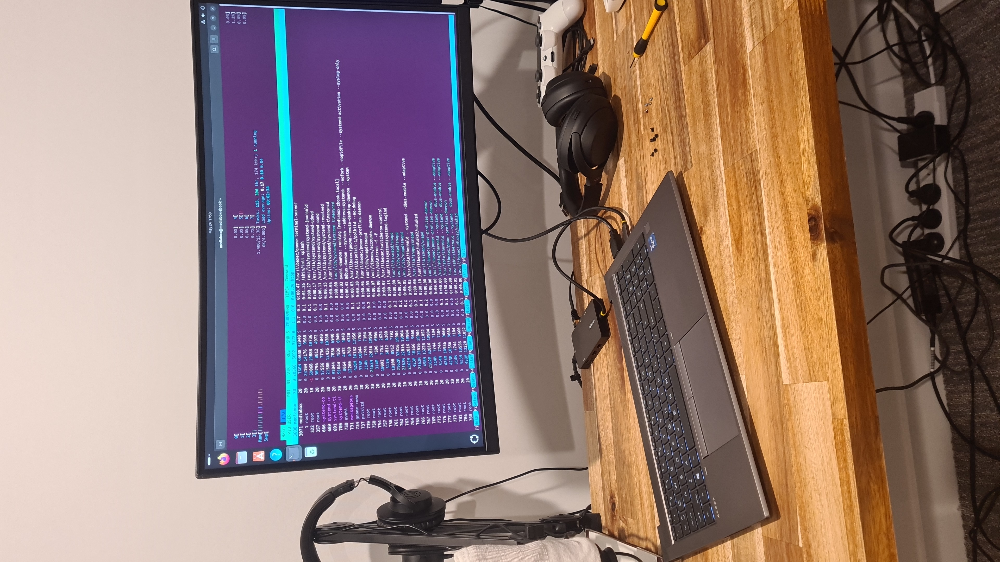
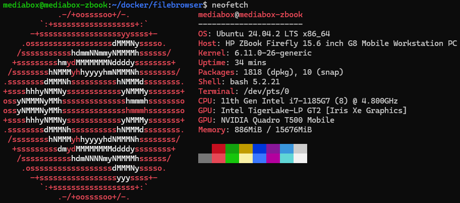

# Overview

Managed to get an old Zbook working after it refused to boot. It had a damaged screen, so I yanked it out and rewired the wifi card.



Turns out it just needed some new RAM sticks and now purrs away happily. Specs:



## Home server setup

All services shall be added to the base README for my own reference and sanity.

I might move these to a different git repo, so I can backup my docker files there..

### Networking

#### DNS setup

For some reason, my local network seems to use some seriously cooked DNS configs. Had to manually change to Google DNS:

```bash
sudo vim /etc/systemd/resolved.conf

# Change:

[Resolve]
DNS=8.8.8.8 8.8.4.4
#FallbackDNS=
#Domains=
#LLMNR=yes
#MulticastDNS=yes
#DNSSEC=no
#Cache=yes
#DNSStubListener=yes
```

```bash
sudo systemctl restart systemd-resolved

# Then check fix:
ping google.com
```

#### Static IP

Quite useful for not having to juggle IP's after reboots. My network is managed, so I can only wiggle around a specific range. Check the name of your connection with:

```bash
nmcli device show wlp0s20f3 | grep 'GENERAL.CONNECTION'

# Assuming output looks like:
GENERAL.CONNECTION:                     BIGCHEESE

# Then modify to a suitable static IP with:
nmcli connection modify "BIGCHEESE" \
  ipv4.addresses 192.111.11.200/24 \
  ipv4.gateway 192.111.11.1 \
  ipv4.dns "1.1.1.1 8.8.8.8" \
  ipv4.method manual

sudo nmcli connection down "BIGCHEESE" && sudo nmcli connection up "BIGCHEESE"
```

Then after a few seconds, you should see a nice new static IP with:

```bash
ip -c -h address
```

#### Samba server

I found that my GUI is sometimes useful, but having a mounted mediashare is nicer for windows --> linux file sharing.
[This guide](https://ubuntu.com/tutorials/install-and-configure-samba#1-overview) is the best one I found online. I just used my own user
as a new samba user, that way I didn't have to deal with extra permissions BS. Probably not very secure though, but for a local setup it should
be fine.

Then, make sure to mount it on a windows machine by:

1. Open File Explorer
2. Right-click on This PC → Map network drive
3. Choose a drive letter (e.g., Z:)
4. In the folder box, enter your Samba share path:
    - Copy
    - Edit
    - \\IP-ADDRESS\sharename
    - Check the box for "Connect using different credentials"
5. Hit Finish

Don't mount it by putting the fileshare address in the network bar, it won't work. At least not for me.

### File server

I like using docker and the [File Browser](https://filebrowser.org/) project seems nice.

```bash
cd /some/folder/you/want/to/use

touch filebrowser.db
mkdir srv # this is the base dir of the web gui
vim filebrowser.json

# Add below json
```

```json
{     "port": 80,     "baseURL": "",     "address": "",     "log": "stdout",     "database": "/database.db",     "root": "/srv" }
```

```bash
vim docker-compose.yml
```

```yml
services:
  filebrowser:
    image: filebrowser/filebrowser
    container_name: filebrowser
    user: 1000:1000
    ports:
      - "8080:80"
    volumes:
      - ./srv:/srv # files will be stored here
      - ./filebrowser.db:/database.db # users info/settings will be stored here
      - ./filebrowser.json:/.filebrowser.json # config file
    restart: always
```

And then you can access this at port 8080 on your host machine. Your hostname should work, or base IP, so either of:

```bash
whoami

ip -c -h address
```
