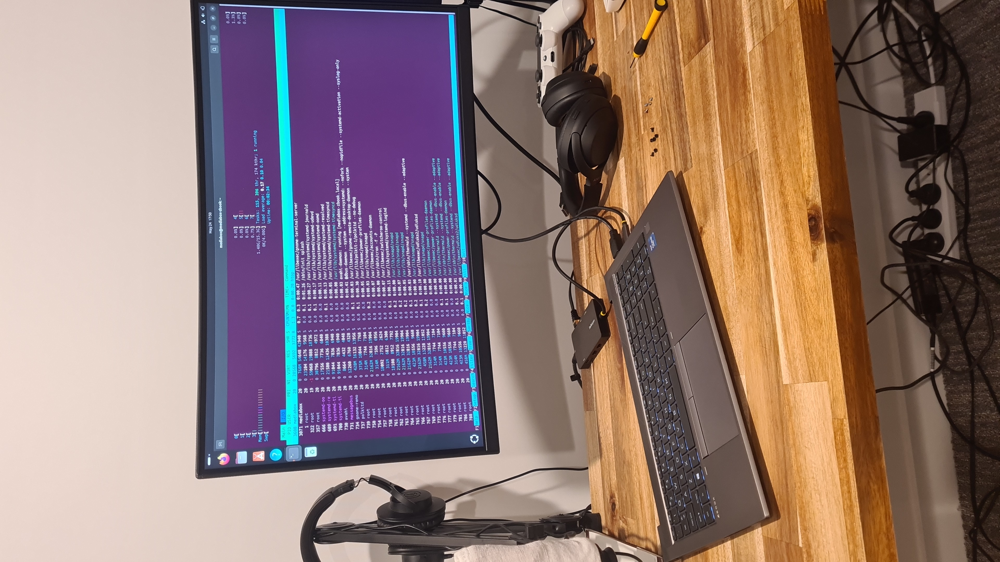
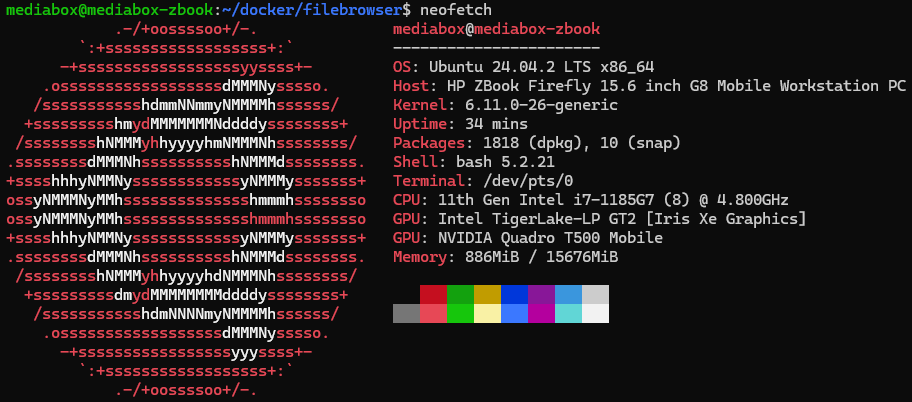
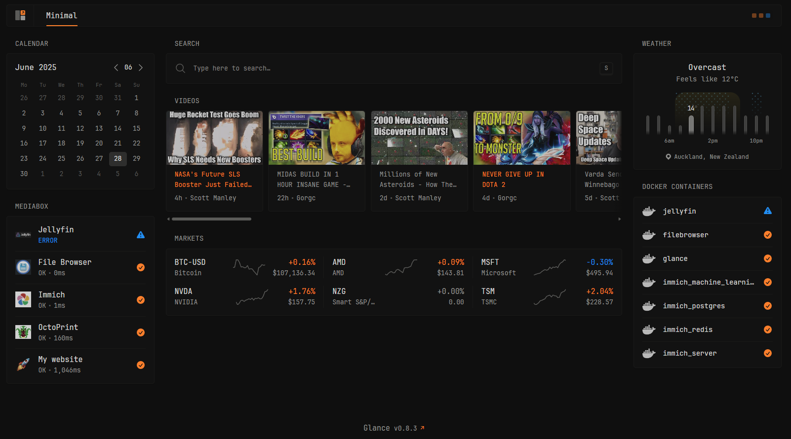

# Overview

Managed to get an old Zbook working after it refused to boot. It had a damaged screen, so I yanked it out and rewired the wifi card.



Turns out it just needed some new RAM sticks and now purrs away happily. Specs:



## Home server setup

I fell in love with the [Glance dashboard](https://github.com/glanceapp/glance). This is a great way to keep track of all of your services and even external websites.



An abridged version of the `.yml` I use and my file structure is:

```bash
$ tree
.
├── assets
│   ├── file-browser-logo.png
│   ├── immich-logo.png
│   ├── jellyfin-logo.png
│   ├── octoprint-logo.png
│   ├── rocket.svg
│   └── user.css
├── config
│   ├── glance.yml
│   └── minimal.yml
└── docker-compose.yml
```

`config/glance.yml`:

```yml
server:
  assets-path: /app/assets

theme:
  # Note: assets are cached by the browser, changes to the CSS file
  # will not be reflected until the browser cache is cleared (Ctrl+F5)
  custom-css-file: /assets/user.css
  background-color: 50 1 6
  primary-color: 24 97 58
  negative-color: 209 88 54

pages:
  # It's not necessary to create a new file for each page and include it, you can simply
  # put its contents here, though multiple pages are easier to manage when separated
  - $include: minimal.yml
```

`config/minimal.tml`

```yml
- name: Minimal
  # Optionally, if you only have a single page you can hide the desktop navigation for a cleaner look
  # hide-desktop-navigation: true
  columns:
    - size: small
      widgets:
        - type: calendar
          first-day-of-week: monday

        - type: monitor
          cache: 1m
          title: Mediabox
          sites:
            - title: Jellyfin
              url: http://your-ip-goes-here
              icon: /assets/jellyfin-logo.png
              allow-insecure: true

            - title: File Browser
              url: http://your-ip-goes-here
              icon: /assets/file-browser-logo.png
              allow-insecure: true

            - title: Immich
              url: http://your-ip-goes-here
              icon: /assets/immich-logo.png
              allow-insecure: true

            - title: OctoPrint
              url: http://your-ip-goes-here
              icon: /assets/octoprint-logo.png
              allow-insecure: true

            - title: My website
              url: https://shaunlowis.com
              icon: /assets/rocket.svg

    - size: full
      widgets:
        - type: search
          search-engine: duckduckgo
          new-tab: true
          bangs:
            - title: YouTube
              shortcut: "!yt"
              url: https://www.youtube.com/results?search_query={QUERY}

        - type: videos
          channels:
            - UCPkaARl89RCckNE_D7tj-aA # Gorgc
            - UC5Ghe5TBQGYIOANuiNW4hDQ # Gary's Economics
            - UCxzC4EngIsMrPmbm6Nxvb-A # Scott Manley
            - UCaYLBJfw6d8XqmNlL204lNg # ESL Dota 2

        - type: markets
          markets:
            - symbol: BTC-USD
              name: Bitcoin
            - symbol: AMD
              name: AMD
            - symbol: MSFT
              name: Microsoft
            - symbol: NVDA
              name: NVIDIA
            - symbol: NZG
              name: Smart S&P/NZX 50
            - symbol: TSM
              name: TSMC

    - size: small
      widgets:
        - type: weather
          location: Auckland, New Zealand
          units: metric # alternatively "imperial"
          hour-format: 12h # alternatively "24h"
          # Optionally hide the location from being displayed in the widget
          # hide-location: true

        - type: docker-containers
          hide-by-default: false
```

Then I also added this page as my default page when I open my Brave browser:

Settings -> Get started -> On startup -> Open a specific page or set of pages.

### Networking

#### DNS setup

For some reason, my local network seems to use some seriously cooked DNS configs. Had to manually change to Google DNS:

```bash
sudo vim /etc/systemd/resolved.conf

# Change:

[Resolve]
DNS=8.8.8.8 8.8.4.4
#FallbackDNS=
#Domains=
#LLMNR=yes
#MulticastDNS=yes
#DNSSEC=no
#Cache=yes
#DNSStubListener=yes
```

```bash
sudo systemctl restart systemd-resolved

# Then check fix:
ping google.com
```

#### Static IP

Quite useful for not having to juggle IP's after reboots. My network is managed, so I can only wiggle around a specific range. Check the name of your connection with:

```bash
nmcli device show wlp0s20f3 | grep 'GENERAL.CONNECTION'

# Assuming output looks like:
GENERAL.CONNECTION:                     BIGCHEESE

# Then modify to a suitable static IP with:
nmcli connection modify "BIGCHEESE" \
  ipv4.addresses 192.111.11.200/24 \
  ipv4.gateway 192.111.11.1 \
  ipv4.dns "1.1.1.1 8.8.8.8" \
  ipv4.method manual

sudo nmcli connection down "BIGCHEESE" && sudo nmcli connection up "BIGCHEESE"
```

Then after a few seconds, you should see a nice new static IP with:

```bash
ip -c -h address
```

#### Samba server

I found that my GUI is sometimes useful, but having a mounted mediashare is nicer for windows --> linux file sharing.
[This guide](https://ubuntu.com/tutorials/install-and-configure-samba#1-overview) is the best one I found online. I just used my own user
as a new samba user, that way I didn't have to deal with extra permissions BS. Probably not very secure though, but for a local setup it should
be fine.

Then, make sure to mount it on a windows machine by:

1. Open File Explorer
2. Right-click on This PC → Map network drive
3. Choose a drive letter (e.g., Z:)
4. In the folder box, enter your Samba share path:
    - Copy
    - Edit
    - \\IP-ADDRESS\sharename
    - Check the box for "Connect using different credentials"
5. Hit Finish

Don't mount it by putting the fileshare address in the network bar, it won't work. At least not for me.

### File server

I like using docker and the [File Browser](https://filebrowser.org/) project seems nice.

```bash
cd /some/folder/you/want/to/use

touch filebrowser.db
mkdir srv # this is the base dir of the web gui
vim filebrowser.json

# Add below json
```

```json
{     "port": 80,     "baseURL": "",     "address": "",     "log": "stdout",     "database": "/database.db",     "root": "/srv" }
```

```bash
vim docker-compose.yml
```

```yml
services:
  filebrowser:
    image: filebrowser/filebrowser
    container_name: filebrowser
    user: 1000:1000
    ports:
      - "8080:80"
    volumes:
      - ./srv:/srv # files will be stored here
      - ./filebrowser.db:/database.db # users info/settings will be stored here
      - ./filebrowser.json:/.filebrowser.json # config file
    restart: always
```

And then you can access this at port 8080 on your host machine. Your hostname should work, or base IP, so either of:

```bash
whoami

ip -c -h address
```
