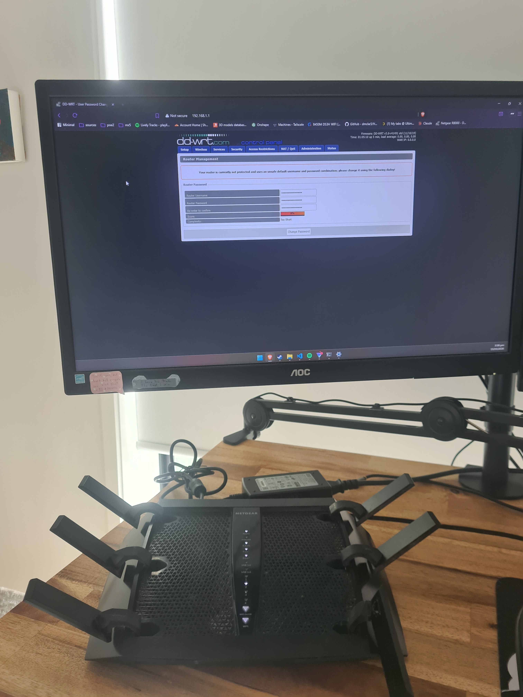

# Overview

Got given a nice Netgear wifi router - but my new ISP doesn't support it, requiring VLAN10 connectivity.

Did a bit of googling and it turns out you can flash an open-source OS on it called dd-wrt, that supports this config.

## Flashing

Was surprisingly easy to do. I followed the guide here:

| Description | Link |
|-------------|------|
| dd-wrt setup procedure | [here](https://ftp.dd-wrt.com/dd-wrtv2/downloads/betas/2019/11-10-2019-r41491/netgear-r8000/) |
| dd-wrt SVN index | [here](https://wiki.dd-wrt.com/wiki/index.php/Netgear_R8000) |

The only issues I ran into were:

- Setup was actually finished before it notified in any way that it was. I'd recommend just doing something else for 20min to be sure install is finished.
- I had to reboot the router, then a wifi network called `dd-wrt` was discoverable. Even though I was connected locally via ethernet, the default `192.168.1.1` route did not yield a webpage over LAN.
- Changing the SSID of the wifi network made the router undiscoverable by windows for a while, forgetting the old network and then rebooting the router resolved this though!

## VLAN setup

Not yet sure if this actually worked, but I set a bridge on the 10 column in VLAN settings, then deleted the default VLAN 2 entries. This should mean that when I connect an ethernet cable from my fibre box, the WAN input (on VLAN 1) should get bridged over to 10 and probably maybe work. Will update!

