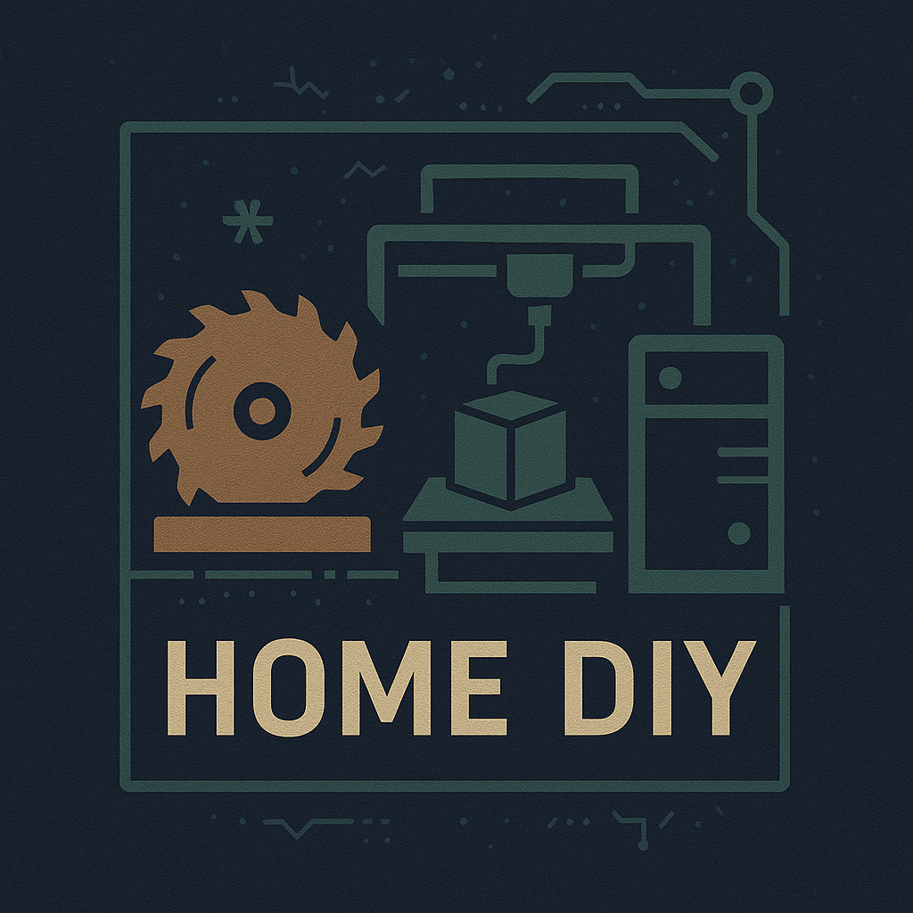

# Shaun's tinkering



For the various projects I tinker with. Mostly for my own reference and lessons learned.

## Timeline

Thanks to my great bud Claude, I have a cool visualiser of what I have been tinkering on when:

<iframe src="timeline/project-timeline.html" width="100%" height="1000" frameborder="0" style="border-radius:12px;"></iframe>

Can be updated with:

```bash
git log --pretty=format:"DATE:%ad | %s" --date=short --name-only > commits.txt
```
