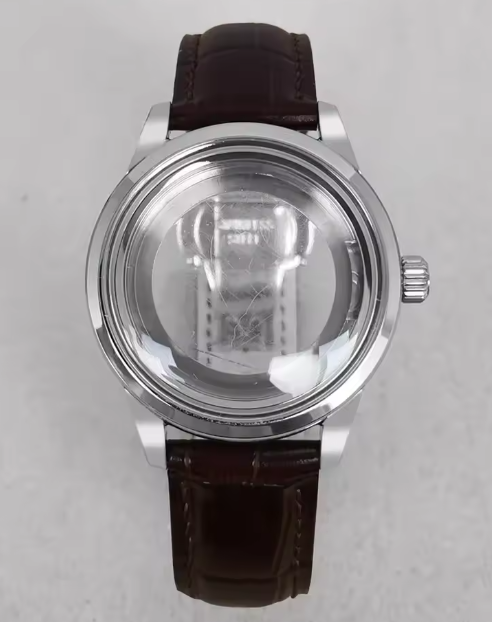
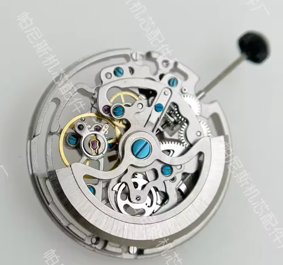
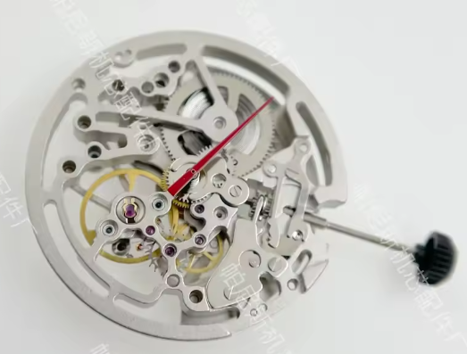
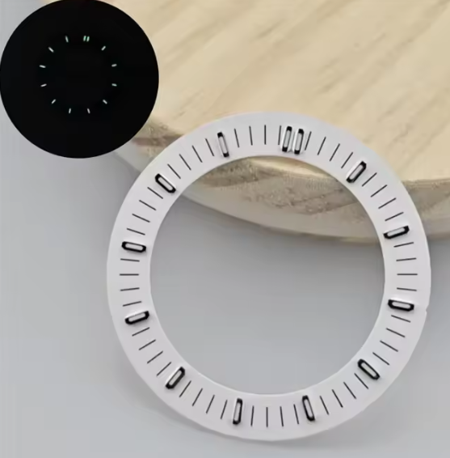
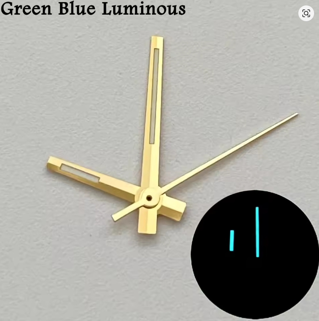
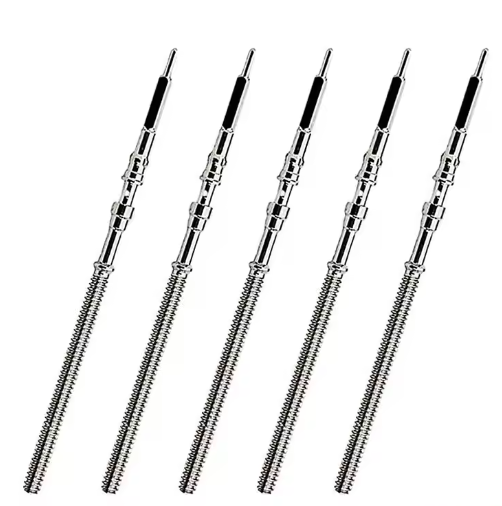
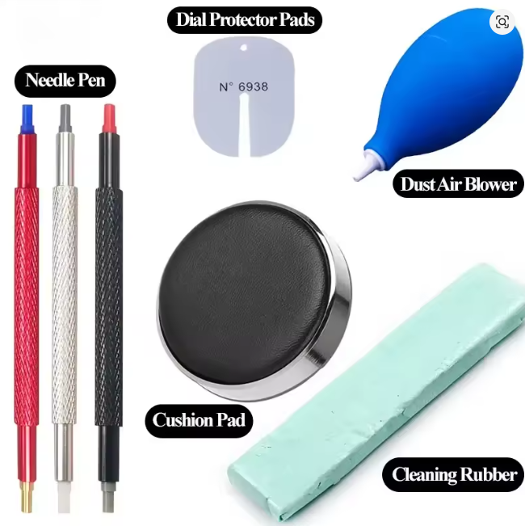
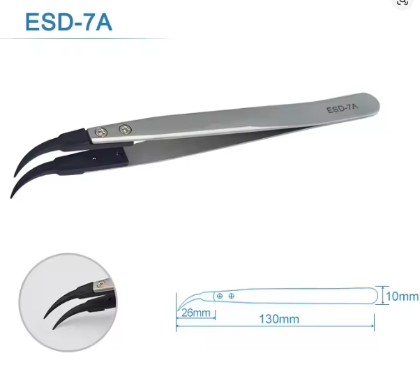
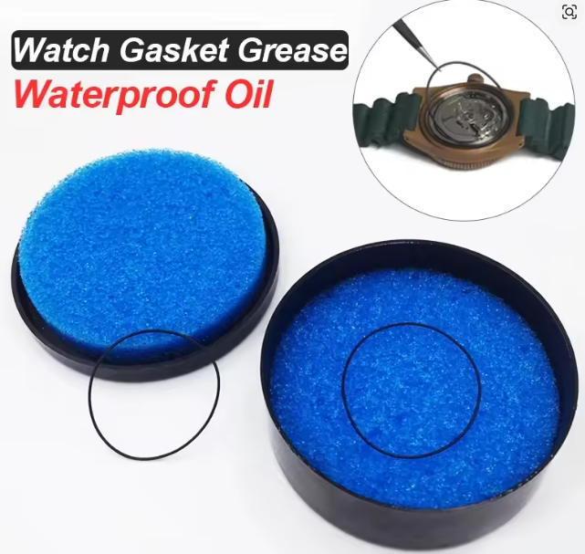

# Custom watch

## Background/Motivation

I quite like fossil watches. I don't like their prices. Let's make one from Ali Express parts and assemble it.

Inspiration watch [here](https://www.fossil.com/en-us/products/townsman-automatic-brown-leather-watch/ME3267.html).

So, this sums to:

- I'd like a face that shows the gears.
- A self winding watch would be great.
- Leather strap is preferred.
- A case that shows the movement from the front and back.

## Equipment

### Materials

- [Watch case](https://www.aliexpress.com/item/1005007800640953.html?spm=a2g0o.order_list.order_list_main.4.398f1802gcTHtZ), $61.21

  
  

- [Hollow self winding movement](https://www.aliexpress.com/item/1005008957300230.html?spm=a2g0o.order_list.order_list_main.40.398f1802gcTHtZ), $43.99

- [Watch dial, hollow face](https://www.aliexpress.com/item/1005008066853454.html?spm=a2g0o.order_list.order_list_main.10.398f1802gcTHtZ), $14.69

- [Watch hands](https://www.aliexpress.com/item/1005008265908532.html?spm=a2g0o.order_list.order_list_main.25.398f1802gcTHtZ), $7.44

- [Watch stem replacement parts](https://www.aliexpress.com/item/1005008853763264.html?spm=a2g0o.order_list.order_list_main.15.398f1802gcTHtZ), $7.78

TOTAL = $135.11

### Tools

- [Watch repair kit](https://www.aliexpress.com/item/1005007417033949.html?spm=a2g0o.order_list.order_list_main.35.398f1802gcTHtZ), $11.50

- [Watch tweezers](https://www.aliexpress.com/item/1005006165435907.html?spm=a2g0o.order_list.order_list_main.30.398f1802gcTHtZ), $4.68

- [Gasket case lubricant](https://www.aliexpress.com/item/1005006514387578.html?spm=a2g0o.order_list.order_list_main.20.398f1802gcTHtZ), $2.38

TOTAL = $18.56

---

**Grand total (materials + tools): $153.67**

---

## Arrival

*Parts arriving — notes and first impressions go here.*

## Construction

*Assembly notes, steps taken, any issues encountered go here.*

## Final Product

*Photos and reflections on the finished watch go here.*