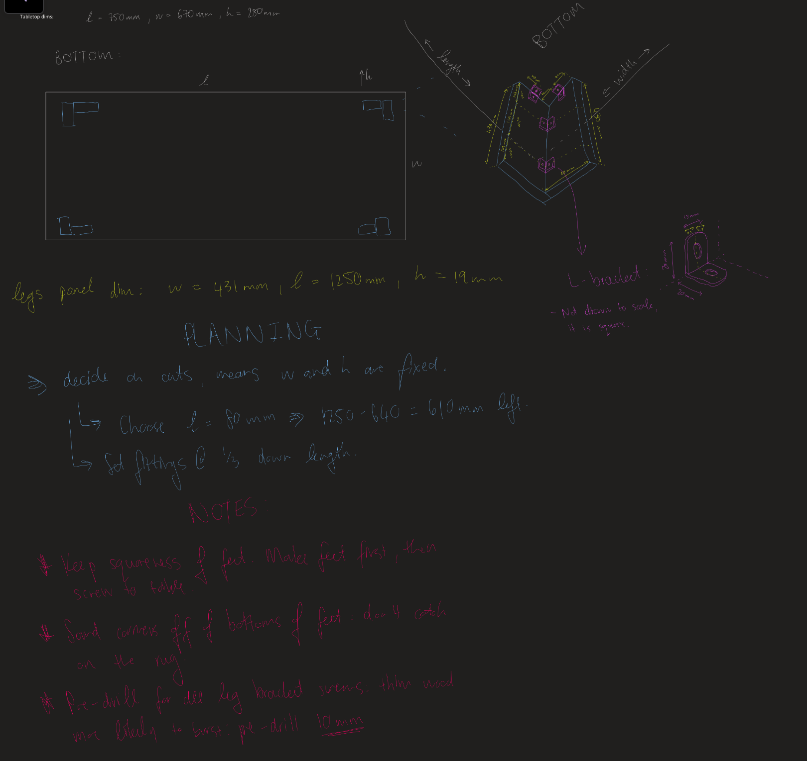
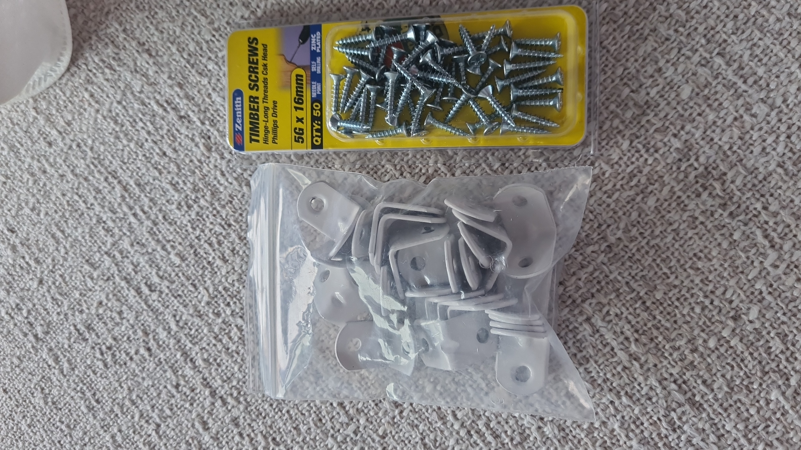
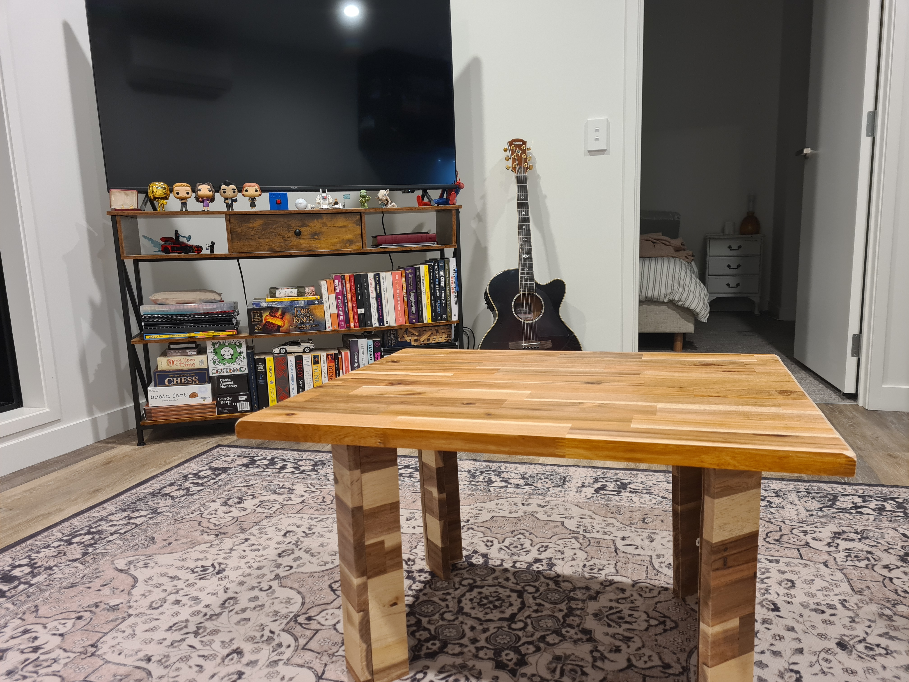
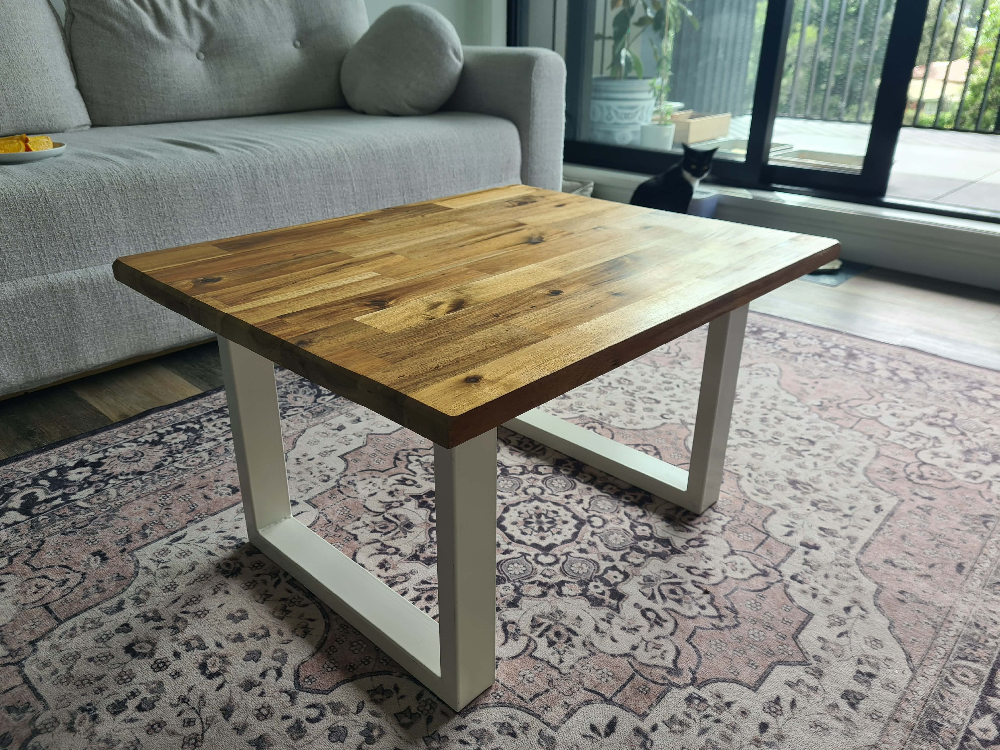

# Overview

With the offcut from the standing desk, the plan is to make a coffee table.

Planning sketch:

This turned out pretty well. I will omit a fair amount of detail, refer to the standing_desk project
for required tools and so on.

## Stuff used

I used these corner brackets, which massively sucked, as the holes in them were not square. But, it was ~$4 for 20. YMMV.

### Trying something funky

I tried a rather spur of the moment design change, to mount the legs at a 45 degree angle with respect to the corners.
This turned out to be awful for stability, which tends to be a valuable thing in a coffee table. It looked moderately cool
for a bit though.

I then changed to trusty 90 degree corners, which, unsurprisingly, yielded much more stable results.

## Making something useful

I frankly hated the way the table looked after my first two sets of experiments. It was finally time to make it look decent. I got
coffee table legs [from Bunnings](https://www.bunnings.co.nz/rapid-450-x-400-x-50mm-white-belize-steel-tube-coffee-table-furniture-leg_p0957227) that look beautiful with the Acacia.

- Re-sanded the table with a fine 800 grit.
- Re-varnished with the same polyurethane varnish.
- Installed the new legs.

