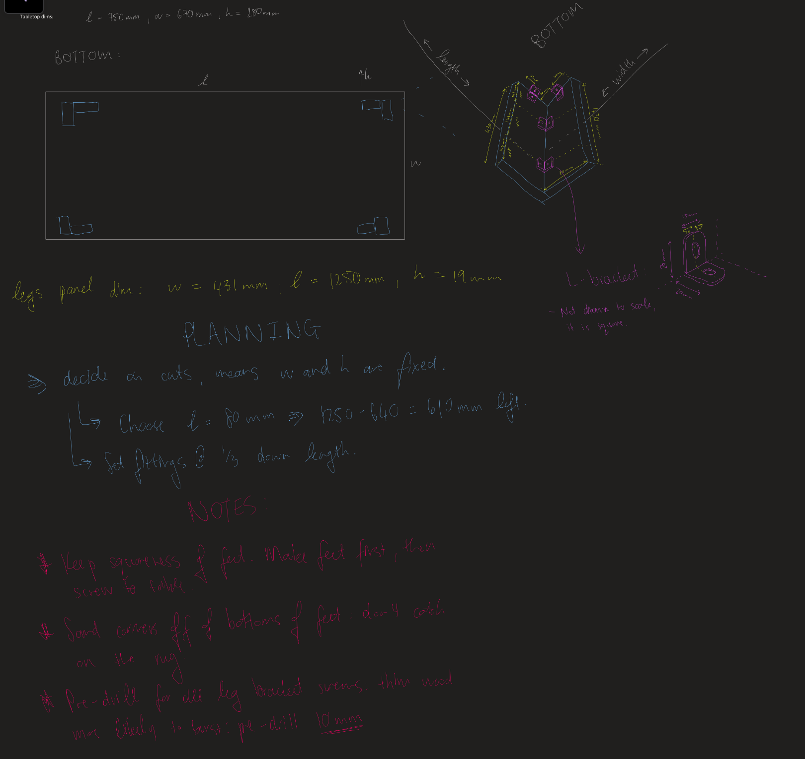
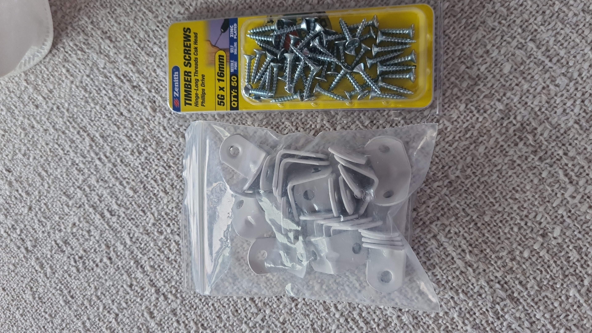
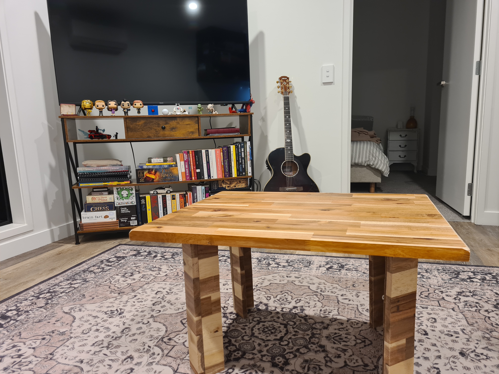

# Overview

With the offcut from the standing desk, the plan is to make a coffee table.

Planning sketch:

This turned out pretty well. I will omit a fair amount of detail, refer to the standing_desk project
for required tools and so on.

## Stuff used

I used these corner brackets, which massively sucked, as the holes in them were not square. But, it was ~$4 for 20. YMMV.

## Trying something funky

I tried a rather spur of the moment design change, to mount the legs at a 45 degree angle with respect to the corners.
This turned out to be awful for stability, which tends to be a valuable thing in a coffee table. It looked moderately cool
for a bit though.

I then changed to trusty 90 degree corners, which, unsurprisingly, yielded much more stable results.

Before copious criticism is leveled at my sawing skill, bear in mind this was cut at night, on top of bar stools, using a hand saw :)
