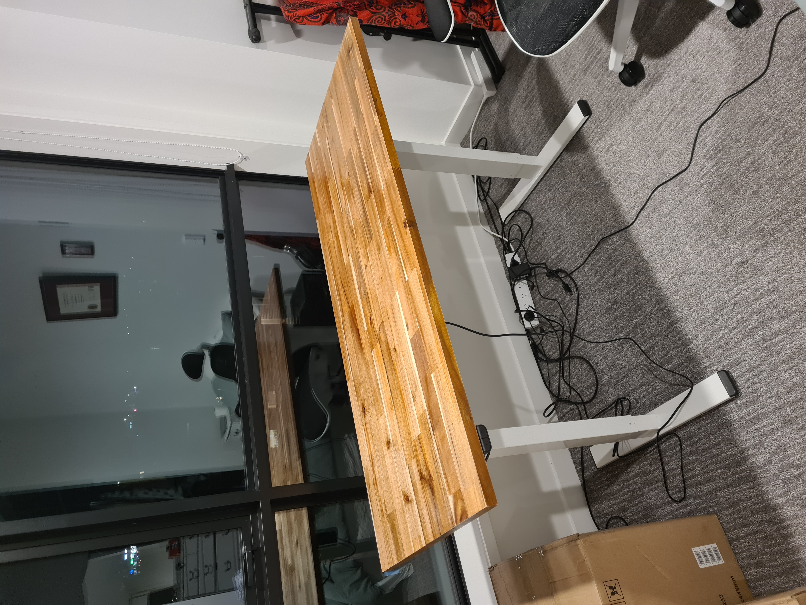
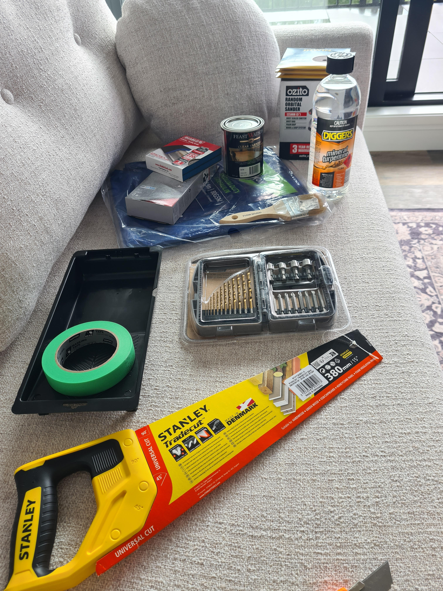

# Custom standing desk

## Background/Motivation

For a while I've been wanting a standing desk, but have always been disappointed by the prices of fully assembled desks, as well as their materials. Ideally, I'd want a hardwood tabletop, for sturdiness and aesthetics. Lastly, I think a white frame looks nice too.

I had a look around and found that, A: the colour combination of white legs with a darker hardwood top doesn't exist. And B: the most similar one I could find was very expensive and not great quality, like this [loctek desk](https://www.pbtech.co.nz/product/DSKLCK118WN/Loctek-Home--Office-All-in-One-Standing-Desk-Maple).

A frame on its own can be quite cheap, I found one for $200, but didn't like the colour and would have had to spray paint it. I decided on a more expensive one for $300 that already came in white. The wood panel itself is very cheap, at [only $50 from bunnings](https://www.bunnings.co.nz/specrite-1200-x-600-x-18mm-golden-teak-acacia-multi-use-panel_p0456528). Again, I went for a more expensive one, to cut it and use the left over section as a coffee table.

## Lessons learned

- The underside of the panel that you saw, especially with a handsaw, will have splits and tears in it. Point the preferred face upwards.
- Start with a low grit sandpaper, like 40. I started with 80 and the wood came pre-oiled, which gummed up the sandpaper very quickly and was very difficult to sand off.
- Masking tape is fantastic as a reference for sawing. Measuring at two points, then joining these points with a strip of tape is a simple way of guaranteeing a nice straight line.
- Use turps to wipe in between sanding to both relieve the tediousness of sanding, but also to see what you are doing much better.
- Don't rush detail sanding after cutting something, you can easily scratch a nice surface and need to then do much more work to redo it.

## Equipment

### Materials

- [SpecRite 2200 x 600 x 26mm Golden Teak Acacia Multi Use Panel](https://www.bunnings.co.nz/specrite-2200-x-600-x-26mm-golden-teak-acacia-multi-use-panel_p0445847)
- [Standing desk frame](https://www.pbtech.co.nz/product/DSKLCK0114GW/Loctek-Electric-Standing-White-Desk-Frame-Only-Sin)
- Sandpaper (various grits: 40, 80, 120, 220)
- Masking tape
- Saw
- Mineral turpentine (turps)

### Tools

- Orbital sander
- Saw
- Drill, drill bits
- Tray for varnish/turps
- Paint brush
- Canvas/drop cloth
- Measuring tape
- Safety goggles and mask

## Process

Place down your tarp and give the panel a wipe with the turps. Get your equipment laid out and pin down the corners in case of wind. Assemble safety gear and get sanding. I strongly recommend a good mask, especially if you are using an orbital sander as it makes a very fine powder.

| Pre sand                   | Closeup |
|:--------------------------:|:-------:|
|[picture](img/raw-full.jpg)|[picture](img/raw-closeup.jpg)|

Start with your low grit and aim for a consistent finish before proceeding from a patch. After finishing the entire tabletop, give it a wipe with turps and a rag. Wait for this to dry properly before proceeding. Repeat until you've done your highest grit sand.

| Post sand                   | Closeup |
|:--------------------------:|:-------:|
|[picture](img/sanded-full.jpg)|[picture](img/sanded-closeup.jpg)|

I decided to varnish the whole panel before cutting it, as I intended to do two layers of varnish. I then couldn't be bothered doing another layer, as it looked nice as is.

After varnishing, the hardwood really comes to life.

[varnished tabletop](img/sanded-varnished.jpg)

From here, I waited for everything to dry, then used the masking tape method outlined earlier and sanded along the edge of the tape.

[sawed tabletop](img/sawed-sanded.jpg)

Then the final steps were to put together the desk and screw it to the tabletop. The linked legs were very simple to assemble and came together really well overall.